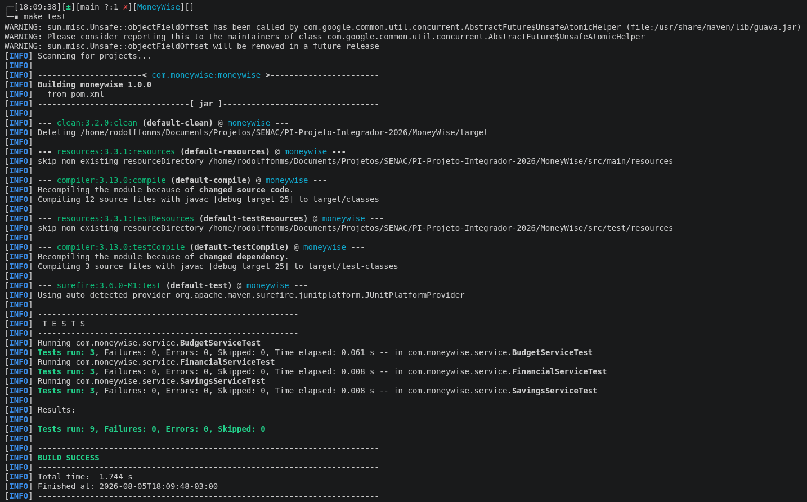

# Relatório — Plano de Teste — MoneyWise

- [Identificação](#1-identificação)
- [Objetivo](#2-objetivo)
- [Escopo](#3-escopo)
- [Estratégia](#4-estratégia)
- [Ambiente de Execução](#5-ambiente-de-execução)
- [Makefile](#6-makefile)

# 1. Identificação
- Projeto: MoneyWise — Controle Financeiro Pessoal
- Etapa: 7 (Testes Unitários)
- Ferramenta: JUnit 5 (Jupiter) + Maven Surefire

## 2. Objetivo
Validar as regras de negócio implementadas (saldo, % de comprometimento,
juros compostos).

## 3. Escopo
- **Dentro:** regras de negócio dos services (cálculos)
- **Fora:** acesso a banco de dados (será testado futuramente)

## 4. Estratégia
- Testes unitários com JUnit 5
- Padrão AAA (Arrange, Act, Assert)
- Foco em funções puras dos services (sem mock)

## 5. Ambiente de Execução
- JDK 25, Maven 3.x
- Comando: `make test` (ou `mvn clean test`)
- Relatório: `target/surefire-reports/`

## 6. Makefile
**Decisão:** Por padrão, sempre trabalhei com a criação de um Makefile, assim eu consigo ser mais produtivo, então tomei a liberdade de aplicar aqui nesse caso de estudo.

**Justificativa:** o Makefile documenta e padroniza os comandos do projeto.  As decisões de design foram:
- `clean` sempre: garante build reproduzível, eliminando resíduos que causam erros enigmáticos (como o ClassNotFoundException, que me tomou uma tarde ^^');
- Uso de `.PHONY`: impede que o make confunda os alvos com arquivos de mesmo nome.

**Para usar, rode no terminal:**
- `make test`
- `make test-smoke` 
- `make run`

*Abaixo uma imagem de smoke test usando make rodado com sucesso:*
