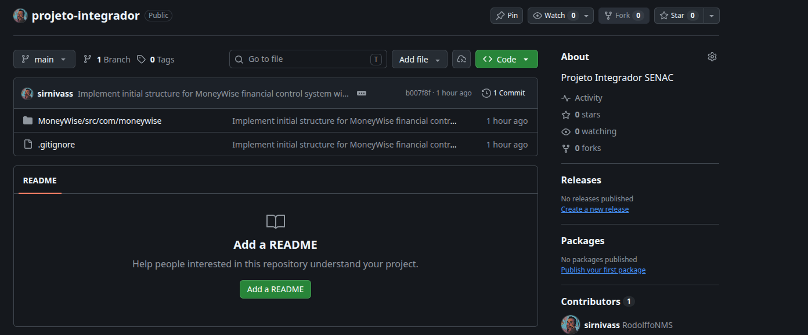

# Relatório — Etapa 6: Sistema MoneyWise com Princípios SOLID

- [Introdução](#introducao)
- [Requisitos do Sistema](#requisitos-do-sistema)
- [Arquitetura e Aplicação dos Princípios SOLID](#arquitetura-e-solid)
- [Evidências do Repositório GitHub](#evidências-git)
- [Testes no main()](#testes-no-main)


### Introducao

O Sistema de Controle Financeiro Pessoal (MoneyWise) é um sistema de controle financeiro pessoal, tem como objetivo simular uma aplicação viável.

Como domínio da aplicação temos: Receitas, despesas, categorias, orçamento mensal.

Os cálculos possíveis são: Saldo atual, porcentagem (%) de comprometimento do orçamento, projeção de economia, juros compostos.

Como eu não tenho mais acesso ao feito nas uc's anteriores, pensei num projeto novo. Tentei aplicar ao máximo os SOLID.


### Requisitos do Sistema

| Funcionais | Não Funcionais |
| - | - |
| Registrar receitas e despesas (valor, descrição, data, categoria) | Aplicar princípios SOLID, com ênfase no SRP |
| Listar transações | Validar funcionalidades via testes no main() |
| Calcular saldo (Σ receitas − Σ despesas) | Código versionado em repositório GitHub
| Calcular % de comprometimento do orçamento | |
| Projetar crescimento de investimento com juros compostos | |
| Definir orçamento mensal por categoria | |

**Regras de Negócio**
1. Saldo = total de receitas − total de despesas
2. % de comprometimento = (gastos da categoria no mês ÷ limite do orçamento) × 100
3. Projeção de investimento = capital × (1 + taxa mensal)ᵐᵉˢᵉˢ

### Arquitetura e SOLID

**Estrutura do projeto**

```bash
MoneyWise/src/com/moneywise/
├── Main.java            → orquestrador (composition root)
├── model/               → dados (POJOs imutáveis)
├── service/             → regras de negócio
├── repository/          → persistência em memória
└── ui/                  → interação com o usuário
```
**Árvore do projeto**

```bash
MoneyWise/
├── src/com/moneywise/
│   ├── Main.java
│   ├── SmokeTest.java
│   ├── model/
│   │   ├── Transaction.java
│   │   ├── TransactionType.java
│   │   ├── Category.java
│   │   └── Budget.java
│   ├── service/         → regras de negócio (cálculos)
│   │   ├── FinancialService.java   
│   │   ├── BudgetService.java      
│   │   └── SavingsService.java     
│   ├── repository/      → persistência
│   │   ├── TransactionRepository.java
│   │   └── BudgetRepository.java
│   └── ui/              → interação (menus)
│       └── ConsoleMenu.java
```

**Aplicação do SRP**

| Classe | Responsabilidade única | Motivo para mudar |
| - | - | - |
| Transaction, Category, Budget | Representar dados | Mudança no domínio |
| FinancialService | Calcular saldo/totais | Mudança na regra de saldo |
| BudgetService | Calcular comprometimento | Mudança na regra de orçamento |
| SavingsService | Projetar investimentos | Mudança na regra de juros |
| TransactionRepository | Persistir/recuperar | Mudança de armazenamento|
| ConsoleMenu | Interagir com usuário | Mudança de interface|

### Evidências Git

- [Link do Repositório](https://github.com/sirnivass/projeto-integrador)
    
- git log: 
    ```
    b007f8f (HEAD -> main, origin/main, origin/HEAD) Implement initial structure for MoneyWise financial control system with core models, services, repositories, and console menu.
    ```

### Testes no main()

- Usei SmokeTest com main() próprio, assim poluí o Main.
- Embora simples, criei alguns cenários possíveis.
